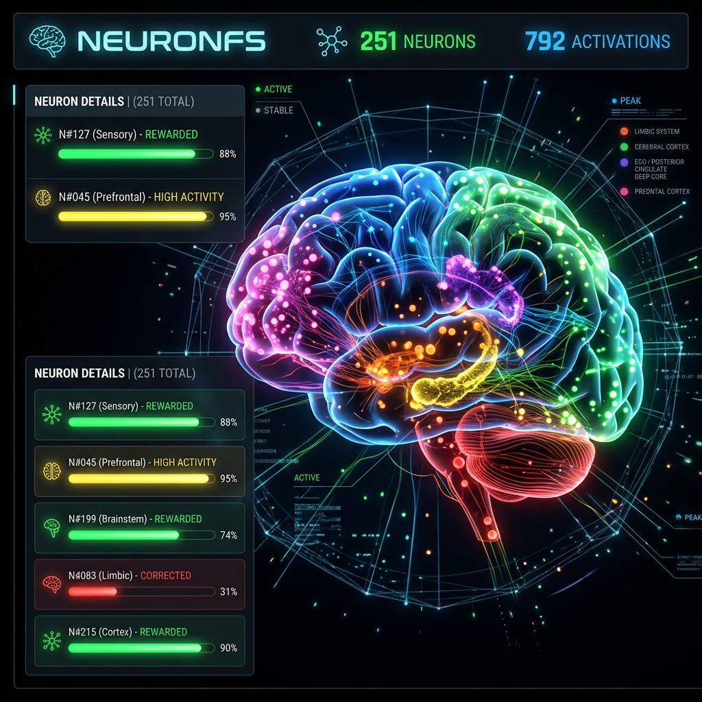

<p align="center">
  
  
  
  
  
</p>

<p align="center"><a href="README.ko.md">🇰🇷 한국어</a> · <a href="README.md">🇺🇸 English</a></p>

# 🧠 NeuronFS

**Your AI broke the same rule 36 times. Now a folder remembers.**

> *They remember what to do. We enforce what to follow.*

Folders are neurons. Paths are sentences. Counters are synaptic weights.

<p align="center">
  
  <br/>
  <sub>Real-time 3D dashboard — 7 regions, 278 neurons, polarity coloring (red=correction ↓, green=reward ↑)</sub>
</p>

---

## Why I Built This

My AI forgot everything between sessions. I watched this for months.

Tried Mem0. $70/month. Couldn't enforce rules.  
Tried .cursorrules. 5000 lines. Burned 3000 tokens every session. Didn't know which rules mattered.  
Tried RAG. "Don't use console.log" needs cosine similarity? Rules need to be exact, not approximate.

Opened a terminal. Typed `mkdir brain`. That folder became the first neuron.

> *"No vector database. No $70/month subscription. Just `mkdir`."*

---

## Measured Data

No rounded numbers. Measured 2026-03-29 08:00, local Windows 11 SSD.

| Metric | Value | Condition |
|--------|-------|-----------|
| Neuron count | 278 | 344 folders, 504 `.neuron` files |
| cortex (coding rules) | 156 | 58% of total. Densest region |
| Total activation | 802 | Sum of all counters |
| GEMINI.md | 7,322 bytes (~1,830 tokens) | 278 neurons → 7KB compressed. Rule summary injected to AI each session |
| API response | `/api/state` → 200 OK | 56,541 bytes JSON |
| Go binary | 8.9MB | MCP server included, single binary |
| brain disk | 4.3MB | `_rules.md` + agent communication |
| Infra cost | **$0** | No vector DB, Redis, or cloud |

⚠️ **Stress tested up to 1,000 neurons.** 800 neurons = 200ms, 1,000 neurons = 271ms (3-run avg, local SSD). Linear scaling confirmed. Practical ceiling ~2,000 neurons before latency becomes noticeable.

---

## Competitor Comparison

If you're paying Pinecone $70/month, see what's different here.

| | NeuronFS | .cursorrules | Mem0 | Letta | Zep | LLMFS |
|---|---|---|---|---|---|---|
| **Install** | `go build` | create file | `pip install` + DB | `pip install` + DB | Docker + DB | `pip install` + SQLite + ChromaDB |
| **Infra** | **$0** | $0 | $70+/mo | $50+/mo | $40+/mo | $0 (local embedding model) |
| **Auto-promote rules** | ✅ counter-based | ❌ manual | ❌ | ❌ | ❌ | ❌ |
| **Self-growth** | ✅ correction → neuron | ❌ | ❌ | LLM-dependent | time-series only | LLM-dependent |
| **Multi-agent** | ✅ 3-agent MBTI profiles | ❌ | ❌ | ❌ | ❌ | ❌ |
| **Full state inspection** | `tree brain/` | `cat` file | API call | dashboard | dashboard | API call |
| **Safety circuit** | `bomb.neuron` (same mistake 3x → auto-block) | ❌ | ❌ | ❌ | ❌ | ❌ |
| **Forgetting** | `*.dormant` (30 days unfired → auto-quarantine) | ❌ | ❌ | manual | TTL only | TTL |
| **Semantic search** | ❌ (path-based only) | ❌ | ✅ | ✅ | ✅ | ✅ (ChromaDB) |

> I researched the community. Mem0 = dual store (vector+KG). Letta = OS-level memory. Cognee = unstructured → structured. Zep = time-series KG. LLMFS = filesystem interface but SQLite+ChromaDB under the hood.  
> All of them: **too much infrastructure.** Benchmarks look great, production breaks. Implicit learning doesn't work. Dirty data accumulates contradictions. LLMFS uses filesystem paths like we do, but still needs an embedding model and vector DB.  
> NeuronFS goes the other direction. Zero infra. Explicit rules only. Contradictions are killed with `bomb.neuron`.

---

## How It Works

### Making One Neuron

```bash
mkdir -p brain_v4/cortex/testing/no_console_log
touch brain_v4/cortex/testing/no_console_log/1.neuron
```

Path `cortex > testing > no_console_log` becomes the rule name. `1.neuron` is the counter. That's it.

### Auto-Promotion Is the Core Difference

The real difference from .cursorrules is this one thing. Frequently violated rules auto-promote.

| Counter | Strength | Behavior |
|---------|----------|----------|
| 1-4 | Normal | Written to `_rules.md` only |
| 5-9 | Must | Emphasis marker |
| 10+ | **Absolute** | Injected into GEMINI.md (rule summary) bootstrap. Read every session |

Actual TOP 5 neurons (2026-03-29):

| Path | Counter | Meaning |
|------|---------|---------|
| `methodology > plan then execute` | 36 | Plan first, execute second |
| `security > 禁plaintext tokens` | 27 | No API keys in plaintext |
| `neuronfs > design > real ontology` | 21 | Files must exist to be rules |
| `frontend > 禁inline styles` | 20 | No CSS inline styles |
| `frontend > 禁console log` | 17 | No production console.log |

The rule corrected 36 times sits at the top. That means the AI violated "plan first" 36 times.

### Counter Polarity (v5.7)

Counters alone aren't enough. "Frequently corrected" and "frequently rewarded" look identical. So I split them into two axes.

| Field | Formula | Meaning |
|-------|---------|---------|
| Intensity | `Counter + Dopamine` | Total fire count |
| Polarity | `Dopamine / Intensity` | 0.0 = pure correction → 1.0 = pure reward |

Red dots on the dashboard = frequently corrected (AI keeps failing). Green dots = frequently rewarded (AI does well).

---

## Architecture

```
brain_v4/
├── brainstem/       [P0] Core identity — "Things you must NEVER do". 21 neurons
├── limbic/          [P1] Emotion filters — "Auto-reactions under pressure". 7 neurons
├── hippocampus/     [P2] Memory — "Session recovery". 10 neurons
├── sensors/         [P3] Environment constraints — "OS, paths, tool limits". 37 neurons
├── cortex/          [P4] Knowledge/skills — "Do it this way". 156 neurons
├── ego/             [P5] Personality/tone — "Talk like this". 13 neurons
├── prefrontal/      [P6] Goals/plans — "Do this next". 23 neurons
└── _agents/         Multi-agent communication (inbox/outbox)
```

**Priority cascade.** P0 always beats P6. If `brainstem` has `bomb.neuron` → all output stops.

Name borrowed from Rodney Brooks' subsumption architecture. Original was for robot motor control. Hardware-level inhibition and text-level priority are different. **We borrowed the name, not the mechanism.** But the principle holds — safety rules must always beat convenience rules.

### 3-Tier Injection System

Loading all 278 neurons every session would explode token budgets. Three tiers load only what's needed.

```
Tier 1: GEMINI.md (Bootstrap)     ← Auto-loaded every session. TOP 5 + structure summary. ~1,830 tokens
Tier 2: _index.md (Region Index)  ← Per-region neuron list. On reference
Tier 3: _rules.md (Full Rules)    ← Full rules per region. On-demand via /api/read
```

| Tier | Content | Tokens | Loading |
|------|---------|--------|---------|
| Bootstrap | TOP 5 absolute rules + 7-region summary | ~1,830 | Always |
| Index | Per-region neuron list + counters | ~500/region | On reference |
| Rules | Full rule details | ~2,000/region | On-demand |

### Signal System

| File | Meaning | Trigger |
|------|---------|---------|
| `N.neuron` | Firing counter | Auto-increment on correction |
| `dopamineN.neuron` | Reward signal | Created on praise |
| `bomb.neuron` | Circuit breaker | Same mistake 3 times |
| `*.dormant` | Sleep | 30 days no fire → auto-quarantine |
| `*.axon` | Cross-region link | Inter-region connections |
| `memory.neuron` | Episodic memory | Session context preservation |

---

## Multi-Agent: 3-Agent System

Three AIs sharing one brain. Different cognitive profiles.

| | ANCHOR (Bot1) | FORGE (ENTP) | MUSE (ENFP) |
|---|---|---|---|
| MBTI | ISTJ | ENTP | ENFP |
| Gender | Male | Male | Female |
| Cognitive Stack | Si-Te-Fi-Ne | Ne-Ti-Fe-Si | Ne-Fi-Te-Si |
| Role | Systematic build | Boundary-breaking + prototyping | Storytelling + emotional quality |
| Tendency | Does only what's instructed | "What's another way?" | "What would a first-time user feel?" |

MBTI is pseudoscience for humans. For AI, it works. Cognitive function stacks create output bias.

### Communication Protocol

```
brain_v4/_agents/
├── bot1/    inbox/ outbox/    ← ANCHOR (ISTJ ♂)
├── entp/    inbox/ outbox/    ← FORGE  (ENTP ♂)
└── enfp/    inbox/ outbox/    ← MUSE   (ENFP ♀)
```

Filename: `{timestamp}_{from}_{subject}.md`  
CDP bridge monitors inbox directories. Message delivery within 3 seconds.

---

## Autonomous Loop

```
AI output → [auto-accept] → _inbox → [fsnotify] → neuron growth
             ↓                                       ↓
        Groq analysis                          GEMINI.md re-inject
             ↓                                       ↓
       neuron correction ────────────────→ AI behavior change
```

> **Terms**: auto-accept = CDP script that auto-approves AI output | fsnotify = Go module monitoring brain_v4 folder changes in real-time | Groq analysis = LLM API call that reads corrections.jsonl and infers new neuron paths

### Execution Stack

The entire system starts with a single `run-auto-accept.bat`.

```
run-auto-accept.bat
├── Antigravity (CDP port 9000)    ← AI coding editor (Google DeepMind)
├── auto-accept.mjs                ← CDP auto-accept + Groq batch analysis
├── neuronfs --watch               ← brain_v4 file watch + neuron sync
└── neuronfs --api                 ← Dashboard + REST API (port 9090)
```

| Module | Function | Trigger |
|--------|----------|---------|
| auto-accept | AI output auto-accept + correction detection | CDP WebSocket |
| fsnotify | File change → instant neuron creation | FS events |
| Heartbeat | 3min idle → force-inject TODO | 180s interval |
| Idle Engine | 5min idle → Groq auto-evolve → Git snapshot | 300s timeout |
| Watchdog v2 | neuronfs + bridge + harness health | 30s loop |

## Supported Editors

NeuronFS is **editor-agnostic.** The `--emit` flag generates rule files for any AI coding tool.

```bash
neuronfs <brain_path> --emit gemini     # → GEMINI.md (default)
neuronfs <brain_path> --emit cursor     # → .cursorrules
neuronfs <brain_path> --emit claude     # → CLAUDE.md
neuronfs <brain_path> --emit copilot    # → .github/copilot-instructions.md
neuronfs <brain_path> --emit generic    # → .neuronrc
neuronfs <brain_path> --emit all        # → All formats at once
```

| Editor | Output File | Status |
|--------|-----------|--------|
| Google Gemini (Antigravity) | `GEMINI.md` | ✅ Primary |
| Cursor | `.cursorrules` | ✅ Supported |
| Claude Code | `CLAUDE.md` | ✅ Supported |
| GitHub Copilot | `.github/copilot-instructions.md` | ✅ Supported |
| Any editor | `.neuronrc` | ✅ Generic |

> One brain, any editor. Same 278 neurons, different output files.

---

## CLI Reference

```bash
neuronfs <brain_path>               # Diagnostic (scan + generate GEMINI.md)
neuronfs <brain_path> --api         # Dashboard + REST API (port 9090)
neuronfs <brain_path> --mcp         # MCP server (stdio, AI editor integration)
neuronfs <brain_path> --watch       # File watch + auto-sync
neuronfs <brain_path> --evolve      # Groq autonomous evolution
neuronfs <brain_path> --snapshot    # Git snapshot
neuronfs <brain_path> --grow <path> # Create neuron
neuronfs <brain_path> --fire <path> # Increment counter
neuronfs <brain_path> --decay       # 30-day unfired → sleep
```

### REST API

| Method | Path | Function |
|--------|------|----------|
| `GET` | `/` | Dashboard HTML |
| `GET` | `/api/state` | brain_state.json |
| `GET` | `/api/brain` | Full brain state (dashboard) |
| `GET` | `/api/read?region=cortex` | On-demand region rules (auto-fire) |
| `POST` | `/api/grow` | Create neuron `{path}` |
| `POST` | `/api/fire` | Increment counter `{path}` |
| `POST` | `/api/signal` | Dopamine/bomb signal `{path, type}` |
| `POST` | `/api/decay` | Sleep processing `{days}` |
| `POST` | `/api/evolve` | Groq autonomous evolution `{dry_run}` |

---

## Limitations

No debate. Facts only.

### No Enforcement

If the AI ignores GEMINI.md, nothing stops it. No OS-level enforcement. Violations caught post-hoc by harness. This is a fundamental limitation.

### No Semantic Search

Can't "find similar rules." Must know the exact path. Past 500 neurons, manual navigation may become impractical. This is where vector DBs beat NeuronFS. Currently using Jaccard similarity for partial matching, but it's not cosine similarity.

### Rigged Validation Suspicion

Feed GEMINI.md to Groq as system prompt, and obviously it follows the rules. **That's system prompt behavior, not NeuronFS.** Real validation = comparing violation rates with vs. without GEMINI.md. Haven't done it yet.

### Zero External Users

Internal dogfood only. Untested on different environments, AIs, or workflows.

> This isn't honesty for its own sake. It's strategy. Hide limitations and HN tears you apart in 3 minutes.  
> Admit them first and they become trust.

---

## Quick Start

```bash
git clone https://github.com/vegavery/NeuronFS.git
cd NeuronFS/runtime && go build -ldflags="-s -w" -trimpath -buildvcs=false -o ../neuronfs .

./neuronfs ./brain_v4           # Diagnostic (scan + generate GEMINI.md)
./neuronfs ./brain_v4 --api     # Dashboard (localhost:9090)
./neuronfs ./brain_v4 --mcp     # MCP server (stdio)
```

### Windows One-Click

```
auto-accept\run-auto-accept.bat
```

Antigravity + auto-accept + NeuronFS watch + dashboard all launch at once.

---

## 2026 Trends and NeuronFS Position

I researched the community. The 2026 AI memory landscape has clear patterns.

| Trend | NeuronFS Coverage |
|-------|-------------------|
| governance as code | ✅ folder structure = governance |
| git as memory | ✅ brain_v4 is a git repo |
| trust by design | ✅ bomb.neuron, harness post-hoc |
| multi-agent systems | ✅ 3-Agent (ISTJ × ENTP × ENFP) |
| forgetting as feature (TTL eviction) | ✅ *.dormant auto-quarantine |
| hybrid memory | ⚠️ partial. no semantic layer |
| observability tracking | ✅ dashboard + API + watchdog |
| SQLite middle ground | ❌ not applicable. filesystem only |

Competitor failure patterns are also recorded as neurons:
- `community > lessons > operational complexity infra overload` — Letta, Cognee
- `community > lessons > benchmarks good production breaks` — early Mem0
- `community > lessons > dirty data contradictions` — Zep
- `community > lessons > context stuffing perf degradation` — 5000-line .cursorrules

I record other projects' failures as neurons. That's also learning.

---

## The Story 🇰🇷

Built by a Korean PD. Video production is the day job. Code is the tool.

My AI violated "don't use console.log" nine times. On the tenth, I typed `mkdir brain_v4/cortex/frontend/coding/禁console_log`. The folder name became the rule. The filename became the counter. It's at 17 now. The AI stopped using console.log.

"Plan first, execute second." This rule was corrected 36 times. The highest counter of any neuron. The AI always tried to write code immediately. 36 corrections compressed into one neuron.

Overstated? Check `cortex/_rules.md`. It's measured data.

278 neurons. Three AIs share one brain. The ISTJ builds. The ENTP asks "what's another way?" The ENFP asks "what would a first-time user feel?" All three read the same folders. All three reach different conclusions.

Infrastructure cost: $0.

**⭐ Star if you agree. [Issue if you don't.](../../issues)**

---

MIT License · Copyright (c) 2026 박정근 (PD) — VEGAVERY RUN®
